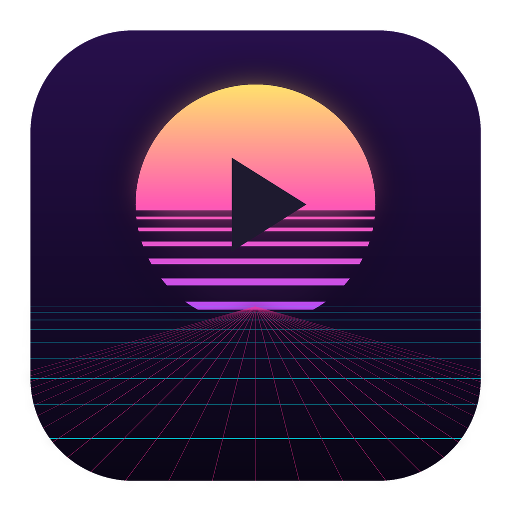

# 🌆 Yutu — Synthwave Player

Reproductor de escritorio (Electron + TypeScript, **Clean Architecture**) con estética **synthwave/retro**. Reproduce **música y video locales (MP3/MP4…)**, videos de **YouTube**, gestiona playlists y te permite **iniciar sesión con Google** para importar tus playlists de YouTube.



## ✨ Novedades (v2.0)

- 🎧 **Reproducción local** — agrega tus archivos `MP3, WAV, FLAC, M4A, AAC, OGG, OPUS` (audio) y `MP4, WEBM, MKV, MOV, AVI` (video) desde tu PC. Streaming local con soporte de _seek_ (HTTP Range).
- 🔴 **YouTube** — pega cualquier URL/ID o busca con tu API Key. Reproducción vía YouTube IFrame API.
- 🟢 **Login con Google (OAuth 2.0 + PKCE)** — inicia sesión de forma segura (navegador del sistema + loopback). Importa tus **playlists de YouTube** a playlists locales.
- 🎨 **Rediseño 360 synthwave** — sol neón, grid en perspectiva animado, scanlines, glassmorphism, glow y tipografía Orbitron. Badges por fuente (YouTube / Local), ecualizador animado y vinilo girando.
- 📦 **Releases automáticos** — GitHub Actions construye y publica instaladores para **Windows (.exe)**, **macOS (.dmg + .zip, Intel y Apple Silicon)** y **Linux (.AppImage + .deb)**.

## 🚀 Desarrollo

```bash
npm install        # dependencias
npm start          # compila y abre la app
npm run build      # solo compilar (tsc + copia de assets)
npm run dist       # generar instaladores para tu plataforma actual
```

## 🎵 Cómo usar

| Acción | Dónde |
|---|---|
| Agregar MP3/MP4 locales | Sidebar → **Archivos locales** |
| Reproducir YouTube | Barra superior → pega URL → **+ URL**, o **Buscar** |
| Crear playlist | Sidebar → ＋ / campo "Nueva playlist" |
| Importar/Exportar playlist | Sidebar → **Importar** · ⬇ en cada playlist |
| Iniciar sesión Google | Sidebar → **Conectar con Google** |
| Importar playlists de YouTube | Perfil → botón **YT** |
| Color de acento, volumen, claves | Barra superior → ⚙ Ajustes |

## 🔐 Configurar el login con Google

El login usa el flujo de **app instalada** (Authorization Code + PKCE). Necesitas tus propias credenciales (gratis):

1. Entra a [Google Cloud Console](https://console.cloud.google.com/) y crea/elige un proyecto.
2. **APIs y servicios → Biblioteca** → habilita **YouTube Data API v3**.
3. **Pantalla de consentimiento OAuth** → tipo *Externo* → agrega tu correo como *usuario de prueba*.
4. **Credenciales → Crear credenciales → ID de cliente de OAuth → Tipo: _App de escritorio_**.
5. Copia el **Client ID** y el **Client Secret**.
6. En Yutu: **⚙ Ajustes → Cuenta de Google** → pega ambos → **Guardar credenciales**.
7. **Conectar con Google** en la barra lateral. Se abrirá tu navegador; al autorizar, vuelve a la app.

> El _Client Secret_ de un cliente de escritorio no es confidencial (Google lo asume así), pero Yutu **nunca** lo expone al proceso de UI: los tokens se guardan localmente en `db.json` y solo el proceso principal los maneja.

### YouTube API Key (búsqueda, opcional)

Para la búsqueda integrada: **⚙ Ajustes → YouTube API Key** (crea una _API Key_ en Cloud Console con YouTube Data API v3 habilitada). Sin ella, puedes seguir agregando videos por URL directa.

## 📦 Publicar un release

Los workflows están en `.github/workflows/`:

- **`ci.yml`** — compila el proyecto en cada push/PR (verifica tipos).
- **`release.yml`** — al empujar un tag `vX.Y.Z` construye y publica los instaladores en _GitHub Releases_.

```bash
# Sube la versión en package.json (ej. 2.0.0) y luego:
git tag v2.0.0
git push origin v2.0.0
```

Esto dispara 3 jobs en paralelo (macOS, Windows, Linux) que suben:

| SO | Artefactos |
|---|---|
| 🪟 Windows | Instalador **NSIS `.exe`** |
| 🍎 macOS | **`.dmg`** + **`.zip`** (x64 y arm64) |
| 🐧 Linux | **`.AppImage`** + **`.deb`** |

> Para **firmar/notarizar** agrega los secrets `CSC_LINK`, `CSC_KEY_PASSWORD` (mac/win) y `APPLE_ID`, `APPLE_APP_SPECIFIC_PASSWORD` (notarización mac) en el repositorio. La publicación a GitHub usa el `GITHUB_TOKEN` automático.

## 🧱 Arquitectura

Clean Architecture: el dominio y los casos de uso no conocen Electron.

```
src/
├── core/                         # Lógica pura (sin Electron)
│   ├── domain/entities/          # Track (youtube | local), Playlist
│   └── application/
│       ├── ports/                # PlayerPort, FileDialogPort, AuthPort, ...
│       ├── services/             # QueueService, toPlayableMedia
│       └── usecases/             # playback, playlists, auth, settings
│
├── main/                         # Proceso principal (Electron)
│   ├── main.ts                   # Ventana + servidor HTTP (player + streaming /media)
│   ├── di/container.ts           # Inyección de dependencias
│   ├── infra/
│   │   ├── player/               # ElectronMediaPlayer (YouTube + local)
│   │   ├── auth/                 # GoogleAuthAdapter (OAuth PKCE + loopback)
│   │   ├── io/ persistence/ youtube/ system/
│   └── ipc/                      # Canales y handlers
│
├── player/                       # WebContentsView del reproductor
│   ├── player-http.html/.js      # Modo dual: iframe YouTube + <video> local
│   └── player-preload.ts
│
├── preload/preload.ts            # API segura expuesta al renderer
└── renderer/                     # UI synthwave (index.html, styles.css, renderer.js)
```

### ¿Cómo reproduce archivos locales?

El proceso principal levanta un pequeño servidor HTTP (`localhost:3456`) que ya servía el reproductor de YouTube. Se le añadió el endpoint **`/media?src=<ruta>`** que hace _streaming_ del archivo con soporte de **Range** (necesario para el _seek_). El `WebContentsView` reproduce YouTube (iframe) o archivos locales (`<video>`/`<audio>`) según la fuente de la pista, controlado por los mismos comandos play/pause/seek/volume.

## ⚖️ Nota legal

Yutu **no** elimina anuncios ni modifica YouTube. Si usas YouTube Premium con sesión iniciada, no verás anuncios; de lo contrario, la reproducción es la normal de YouTube.

## 🛠️ Tecnologías

Electron · TypeScript · YouTube IFrame API · OAuth 2.0 (PKCE) · electron-builder · electron-updater · GitHub Actions.

---

Hecho con 💜 en modo synthwave.
